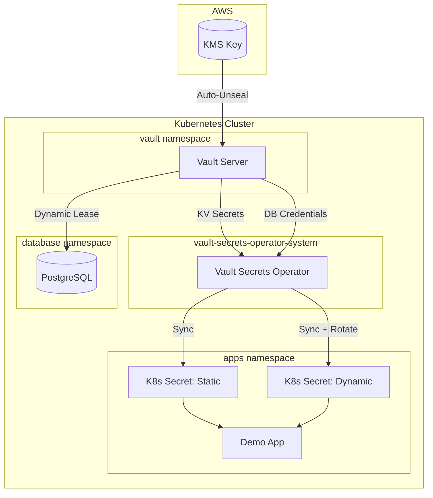

# HashiCorp Vault on Kubernetes

Production-grade HashiCorp Vault setup with **static secrets** (KV) and **dynamic secrets** (PostgreSQL) using the Vault Secrets Operator.

## 🏗️ Architecture



## ✨ Features

| Feature                    | Description                               |
| -------------------------- | ----------------------------------------- |
| **Static Secrets**         | KV secrets synced to K8s via VSO          |
| **Dynamic Secrets**        | PostgreSQL credentials with auto-rotation |
| **4 Deployment Modes**     | Dev, AWS KMS, AWS KMS Raft HA, Manual     |
| **Auto-Unseal**            | AWS KMS integration for production        |
| **High Availability**      | Raft HA cluster (3-node) support          |
| **Vault Secrets Operator** | Modern CRD-based secret sync              |

## 🛠️ Components

| Component                  | Version | Purpose                           |
| -------------------------- | ------- | --------------------------------- |
| HashiCorp Vault            | 1.15+   | Secrets management                |
| Vault Secrets Operator     | 0.4+    | K8s secret synchronization        |
| PostgreSQL (CloudNativePG) | 16      | Demo database for dynamic secrets |

## Prerequisites

- Kubernetes cluster (Minikube, kind, or cloud)
- kubectl
- Helm 3.x
- (Optional) AWS CLI for KMS auto-unseal

---

## 🚀 Quick Start

The interactive script handles everything:

```bash
bash ./scripts/deploy.sh
```

You will be prompted to choose a **Vault Mode**:

| Mode                   | Description                  | Use Case          |
| ---------------------- | ---------------------------- | ----------------- |
| **1. Dev**             | Auto-unsealed, token: `root` | Quick testing     |
| **2. AWS KMS**         | Auto-unseal, single node     | Production        |
| **3. AWS KMS Raft HA** | Auto-unseal, 3-node cluster  | High Availability |
| **4. Manual**          | Requires manual init/unseal  | Learning          |

---

## 📁 Project Structure

```
kubernetes/
├── 00-namespaces.yaml
├── database/
│   ├── postgres-secrets.yaml
│   └── postgres-cluster.yaml
├── vault/
│   ├── dev/
│   │   ├── vault-values-dev.yaml
│   │   ├── vault-config-cm.yaml
│   │   └── vault-config-job.yaml
│   ├── manual/
│   │   └── vault-values-manual.yaml
│   ├── aws/
│   │   ├── vault-values-aws.yaml
│   │   └── vault-values-aws-raft.yaml
│   └── vault-rbac.yaml
└── apps/
    ├── service-account.yaml
    ├── vault-connection.yaml
    ├── vault-auth.yaml
    ├── static-secret.yaml
    ├── dynamic-secret.yaml
    └── demo-app.yaml
```

---

## 🟢 Mode 1: Dev (Fastest)

Vault starts **unsealed** with token `root`. Great for testing.

```bash
bash ./scripts/deploy.sh  # Choose option 1
```

**Done!** Check demo app:

```bash
kubectl logs deployment/myapp -n apps
```

---

## 🟡 Mode 2: AWS KMS Standalone (Production)

Single-node Vault with AWS KMS auto-unseal. Simple and reliable.

### Step 1: Create AWS Resources

```bash
# Create KMS key
aws kms create-key --description "Vault Auto-Unseal" --region ap-south-2

# Create alias
aws kms create-alias --alias-name alias/vault-unseal --target-key-id <KEY_ID> --region ap-south-2

# Create IAM user with KMS permissions
aws iam create-user --user-name vault-kms-user
aws iam create-policy --policy-name VaultKMSUnseal --policy-document '{
  "Version": "2012-10-17",
  "Statement": [{
    "Effect": "Allow",
    "Action": ["kms:Encrypt", "kms:Decrypt", "kms:DescribeKey"],
    "Resource": "arn:aws:kms:ap-south-2:<ACCOUNT_ID>:key/<KEY_ID>"
  }]
}'
aws iam attach-user-policy --user-name vault-kms-user --policy-arn arn:aws:iam::<ACCOUNT_ID>:policy/VaultKMSUnseal
aws iam create-access-key --user-name vault-kms-user
```

### Step 2: Create K8s Secret

```bash
kubectl create secret generic vault-aws-creds -n vault \
  --from-literal=AWS_ACCESS_KEY_ID="AKIA..." \
  --from-literal=AWS_SECRET_ACCESS_KEY="..."
```

### Step 3: Deploy

```bash
bash ./scripts/deploy.sh  # Choose option 2
```

### Step 4: Initialize (First Time Only)

```bash
kubectl exec -ti vault-0 -n vault -- vault operator init
```

> Save the **Recovery Keys** and **Root Token**. Vault auto-unseals immediately!

### Step 5: Configure

```bash
export VAULT_ADDR="http://<NODE_IP>:<NODE_PORT>"
export VAULT_TOKEN="hvs.<YOUR_TOKEN>"
bash ./scripts/configure-vault.sh
```

> [!TIP] > **Want Raft HA (3-node cluster)?** Use the same AWS setup above, then choose **option 3** in deploy.sh. Requires 3+ worker nodes.

---

## 🔴 Mode 4: Manual Unseal (Learning)

Vault starts **sealed**. You must manually initialize and unseal.

### Step 1: Deploy

```bash
bash ./scripts/deploy.sh  # Choose option 4
```

### Step 2: Initialize

```bash
kubectl exec -ti vault-0 -n vault -- vault operator init
```

> [!IMPORTANT]
> Save the **5 Unseal Keys** and **Root Token**. You will need 3 keys to unseal.

### Step 3: Unseal (3 times)

```bash
kubectl exec -ti vault-0 -n vault -- vault operator unseal
# Paste key 1, then repeat for key 2 and key 3
```

### Step 4: Verify

```bash
kubectl exec -ti vault-0 -n vault -- vault status
# Sealed should be 'false'
```

### Step 5: Configure

```bash
export VAULT_ADDR="http://<NODE_IP>:<NODE_PORT>"
export VAULT_TOKEN="hvs.<YOUR_TOKEN>"
bash ./scripts/configure-vault.sh
```

---

## ✅ Verify Secrets

```bash
# Check static secrets
kubectl get secret myapp-api-keys -n apps -o jsonpath='{.data.stripe_api_key}' | base64 -d

# Check dynamic secrets
kubectl get secret myapp-db-credentials -n apps -o jsonpath='{.data.username}' | base64 -d

# Watch demo app logs
kubectl logs -f deployment/myapp -n apps
```

---

## 🔒 Security Best Practices

### 1. Revoke Root Token After Setup

> [!IMPORTANT]
> The root token has unlimited privileges and never expires. **Revoke it immediately after initial configuration.**

```bash
# After running configure-vault.sh, revoke the root token
vault token revoke <ROOT_TOKEN>

# If you need root access later, generate a new one (requires unseal keys)
vault operator generate-root -init
```

### 2. Use Short TTLs for Dynamic Secrets

The default lease for database credentials is set to **1 hour** with max **24 hours**. In production, consider even shorter:

```hcl
# In configure-vault.sh, the database role uses:
default_ttl = "1h"
max_ttl     = "24h"
```

Shorter TTLs = smaller window if credentials are compromised.

### 3. Enable Audit Logging (Production)

```bash
# Enable file audit log
vault audit enable file file_path=/vault/logs/audit.log

# Or send to stdout for K8s log collection
vault audit enable file file_path=stdout
```

### 4. Design Decisions

| Decision                                          | Reason                                                               |
| ------------------------------------------------- | -------------------------------------------------------------------- |
| **IAM User credentials** (not IRSA)               | Kubernetes-agnostic: works on minikube, kind, GKE, AKS, not just EKS |
| **Vault Secrets Operator** (not Sidecar Injector) | Simpler, CRD-based, better for GitOps                                |
| **Single KMS key**                                | Demo simplicity; production may use separate keys per environment    |

---

## 🧹 Cleanup

```bash
bash ./scripts/cleanup.sh
```
